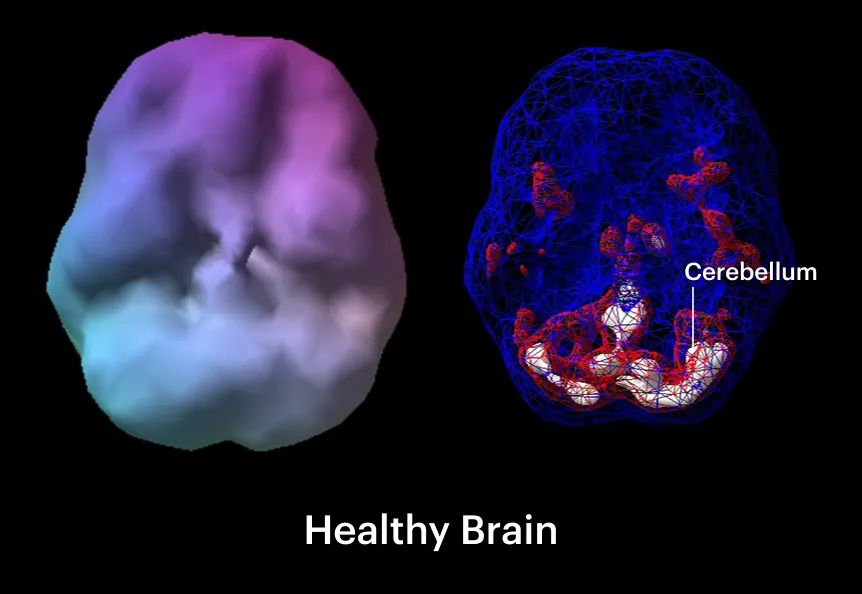
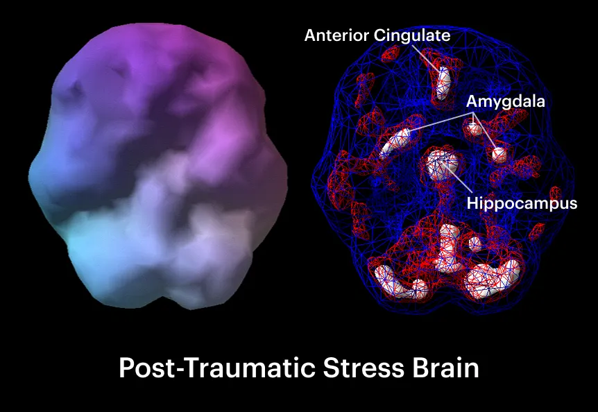
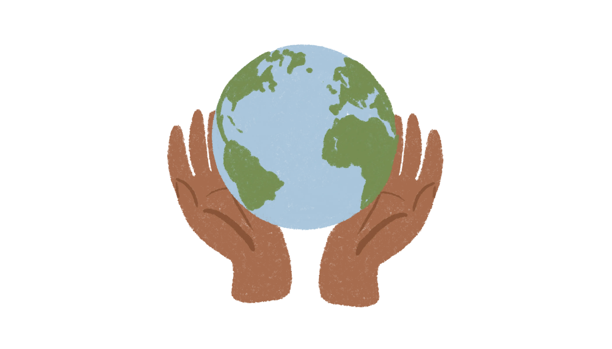
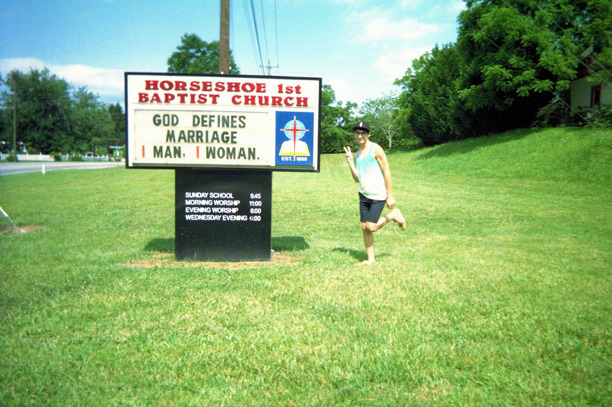

<aside>

**Note, July 2026:** This article was originally published [on Medium](https://medium.com/care-code/to-build-gentler-technology-practice-trauma-informed-design-3b4ad34a9f0b) while working as a designer at [Cityblock](https://www.cityblock.com) in 2021. On reflection, there are aspects of this I would rewrite or scope down. For posterity, I'm republishing it here as originally written.

</aside>

When I was sixteen, YouTube outed me. My mom walked into my bedroom one day and hit me with a question that stopped my heart:

“Are you gay?”

She told me that she and my younger brother had used my computer to visit YouTube and saw videos. She wanted to know where the videos came from. She wanted to know if I was gay.

I’d feared this moment for so long, and I wasn’t ready.

<figure>
  (quality:90)
  <figcaption>
    A truck with several confederate flags near my childhood home in Horse Shoe, North Carolina.
  </figcaption>
</figure>

I grew up in a Southern Appalachian town called Horse Shoe, where I drove past Confederate flags every day on my way to school. I spent most of my early teens trying to “pray the gay away” in earnest. Driven by fear and self-loathing, I repressed any emotion or expression which could’ve brought on the wrath of a high school boy or the scorn of an adult.

As a teenager, the internet was my solace. I didn’t know any queer people in my 600-person school, and I had no adults in my life who were outwardly LGBT+. In the physical world I was closeted and stoic. In the digital world, I found people like me, and it made me feel less alone.

I knew these worlds needed to stay separate. There were real, physical risks if my parents discovered my online activity: they might kick me out, or send me to conversion therapy, or worse. I diligently scrubbed my browsing history, used alternate email addresses, and waited until late at night—when my parents were more likely to be asleep—to watch vlogs and chat.

But it only takes one slip-up. I hadn’t thought about the YouTube recommendations.

<figure>
  (quality:90)
  <figcaption>
    A church in Horse Shoe proclaims, “OBEDIENCE IS BETTER”.
  </figcaption>
</figure>

I’d planned to come out to my parents eventually. I just didn’t want to do it then, in that way. I wanted to do it on my own terms.

When my mom asked if I was gay, I faced a choice. I could deny it, which might keep me safe for awhile. Or I could tell the truth and pay the price.

Through tears, I told the truth.

---

<aside>

LinkedIn informs you that three strangers viewed your profile and one of them asked to connect. Duolingo prompts you to start a new lesson—it’s been six days since you practiced German. WhatsApp says your message was seen, but nobody’s replied. You receive twelve new likes on an Instagram post. There’s a Swipe Surge on Tinder! Facebook recommends [people you may know](https://www.youtube.com/watch?v=LoyfunmYIpU&pbjreload=102).

Can you spot the potential harm in these interactions?

</aside>

Two years ago, I joined [Cityblock](https://www.cityblock.com/). Alongside psychiatrists, social workers, and other specialists, I work to provide care to people with complex health needs.

An undercurrent of trauma runs through the populations we serve. To counter this we practice trauma-informed care. Trauma-informed care is a framework for minimizing harm through understanding trauma and its effects and proactively working to prevent re-traumatization.

<blockquote class="pull">
Rather than asking, “what is wrong with you?” a trauma-informed approach asks, “what has happened to you?”
</blockquote>

As I learned about trauma-informed care I began to wonder, **what would technology look like if it recognized trauma as a force in all our lives?**

Over the past six months, I’ve interviewed care teams at Cityblock to understand how they confront trauma. They’ve shared tips on technique and language, and shared stories. Together we’ve explored how we might design technology from a trauma-informed lens.

## Trauma-informed design is the practice of building systems which reduce harm and foster healing

There are six principles for a trauma-informed approach:

1. Safety
2. Trustworthiness and Transparency
3. Peer Support
4. Collaboration and Mutuality
5. Empowerment, Voice, and Choice
6. Cultural, Historical, and Gender Issues

These principles were developed by the Substance Abuse and Mental Health Services Administration (SAMHSA) and the American Psychiatric Association to address in-person care, but we can adapt them to a digital context.

Before that, however, it’s important to talk about what trauma is and how it affects the brain.

### Trauma is an experience that overwhelms someone’s ability to cope

Trauma can occur as a result of violence, sexual abuse, physical abuse, loss, terrorism, natural disaster, and other emotionally harmful experiences. It may be a single moment, or a pattern of events spread out over months, years, or generations. It affects anyone.

> Trauma affects the way that you view the world and the way that you view yourself.
> <cite>Rob Jordan, Behavioral Health Specialist at Cityblock</cite>

Trauma exists as an embodied, measurable force. It rewires neural pathways. It manifests through avoidance, nightmares, flashbacks, anxiety, dissociation, hypervigilance, and intrusive memories.

### Tech can frustrate stressed-out brains

Imagine this:

- Someone presents you with new information. You register what you’ve been told, but before long, you can’t remember what it was. Was it important?
- Images, words, shapes, and motion don’t always appear “present”. They’re somehow detached from reality. You struggle to recall them.
- It’s hard to categorize objects. What goes where?
- When filling out a form or something that requires accuracy, you often make errors and don’t spot them until you’re told.
- Staying focused is a challenge. You often feel unmotivated to start and complete tasks. Small distractions can wreck your concentration.
- Tiny things can provoke strong anger or fear or make you unable to move. Later, you may tell yourself that your response wasn’t rational, but this doesn’t prevent it from happening again.

This is life for many people with a history of trauma, and it presents serious obstacles to everyday use of technology.

**Minor frustrations for non-traumatized brains may present serious obstacles for traumatized ones.**

This happens because extreme stress changes the brain’s structure. It decreases the volume of the anterior cingulate cortex — which deals with attention, error detection, and motivation — and the volume of the hippocampus, which helps encode verbal declarative memory.

<figure>
  

    

    
  

  <figcaption>
    On the left: a healthy brain shows most activity (red and white) in the cerebellum. On the right: A PTSD brain shows changes to the anterior cingulate cortex, the amygdala, and the hippocampus. [Source](https://journals.plos.org/plosone/article?id=10.1371%2Fjournal.pone.0129659).
  </figcaption>
</figure>

In addition, the amygdala — the brain’s fear response center—becomes overactive, making [higher-level thinking](https://www.youtube.com/watch?v=py8deTlxNco) much more difficult.

These changes to the brain are visible in people with PTSD, but PTSD is only one subset of trauma, which affects the brain, body, and spirit in many ways.

### Trauma-informed design is accessible design

The physical world can inform our approach to designing digital spaces. In the 1960s, 70s, and 80s, people who use wheelchairs waged a campaign to require cities to build [curb cuts](https://99percentinvisible.org/episode/curb-cuts/)—the ramp connecting sidewalks to street-level. Without them, the six-inch drop made cities unnavigable.

The Americans with Disabilities Act was passed in 1990, making accessibility a requirement for all public spaces. It wasn’t long before parents with strollers, postal workers with mail carts, and kids on bicycles realized how helpful curb cuts could be for them, too.

By prioritizing those with the greatest need, trauma-informed design improves life for everyone.

## Six principles for trauma-informed design

We can get close to trauma-informed solutions by simply practicing “[good design](https://www.vitsoe.com/us/about/good-design).” Many design patterns exist in direct response to the quirks and limitations of human cognition. Intuitive organization, [familiar interaction patterns](https://www.nngroup.com/videos/jakobs-law-internet-ux/), intentional use of [visual principles](https://www.nngroup.com/articles/principles-visual-design/), and the ability to [offload working memory](https://www.nngroup.com/articles/working-memory-external-memory/) all make people feel calmer and more in control.

Even small frustrations and cognitive burdens drain our ability to make informed, healthy choices.

“The least frustrating design,” says Rob, “is going to be trauma-informed.”

While researching, I asked friends and family to share moments when technology has hurt them and when it has helped. Their thoughts, anonymized, are quoted in each section below.

### Safety

> Dating apps automatically pulling info from Facebook has allowed people to find me on other platforms and say, hey, we didn’t match, but \*hey\*, I \*really\* liked you.

> A band member I follow shared a brutal video on Instagram and I literally felt ill. Like visceral, horrible. I had to swipe up to get it out of my phone’s frame.

> [Noonlight](https://www.noonlight.com/) and iPhone’s [SOS feature](https://support.apple.com/en-us/HT208076) give me peace of mind knowing I have a modern-day Life Alert built into the thing I carry around with me everywhere.

To help people with a history of trauma, “safety is the first priority,” says [Loretta Staples](https://www.nytimes.com/2021/03/18/style/loretta-staples-ui-design.html), Behavioral Health Specialist at Cityblock. “Oftentimes, traumatized people do not feel safe in their own body. I try to create a holding environment, one where the person feels not smothered, but contained.”

She continues, **“I never say, ‘this is a safe space.’ I don’t have the power to make that declaration.”**

The systems that we design should counter abuse, permit making safe mistakes, promote privacy by default, and moderate content to prevent the spread of hate speech and disinformation.

<aside>

**Recommendations:**

- **Conduct abusability testing.** “From Zoombombing to discriminatory chatbots, we track abuses across a wide range of platforms,” states [platformabuse.org](https://platformabuse.org/). Building with good intent isn’t enough to stop abuse. But understanding common patterns and mitigations makes it possible to prevent abuse from happening.
- **Support making (and fixing) mistakes.** Humans are fallible and distractible. If someone makes a mistake, provide an easy way to undo or fix it, paying close attention to the tone that’s used to [communicate the error](https://www.nngroup.com/articles/error-message-guidelines/). Permanency is stress-inducing; impermanence fosters psychological safety.
- **Default to privacy.** Say there’s third-party integration you share data with. Do you ask for consent from users before sharing their data? [Fewer than 5% of people change the default settings](https://archive.uie.com/brainsparks/2011/09/14/do-users-change-their-settings/), so make sure default sharing settings promote privacy and safety.
- **Moderate content thoughtfully.** In digital spaces, profound harm can come from other users; preventing trauma requires placing limits on what users can say and do. [The Santa Clara Principles on Transparency and Accountability in Content Moderation](https://santaclaraprinciples.org/) outline three principles for fair content moderation. Additionally, the Forum on Information and Democracy’s [Report on Infodemics](https://informationdemocracy.org/working-groups/concrete-solutions-against-the-infodemic/) lists “250 recommendations on how to rein in a phenomenon that threatens democracies and human rights, including the right to health.”

</aside>

### Trustworthiness and transparency

> I feel spied on. It’s weird if you show up to, say, a hotel, and the concierge knows all about your personal life. That’s what some products in tech feel like.

> Whenever I search something on Google and then I see an ad for that on Instagram, I wonder, if they know that about me, what else do they know? It makes me feel vulnerable and exposed.

The Diagnostic and Statistical Manual of Mental Disorders mentions “a sense of foreshortened future” as a symptom of trauma. Trauma damages trust, and a [lack of trust warps the experience of time itself](https://www.ncbi.nlm.nih.gov/pmc/articles/PMC4166378/), states a 2014 study. Survivors of trauma often strongly believe that bad things — like dying early, or suffering rejection — are sure to befall them.

“Trust has been violated with many individuals with a history of trauma,” says Rob.

Broken trust is difficult to rebuild. But we can work to promote trust by practicing transparency. Don’t exploit or manipulate people. Don’t ask for unnecessary information. Eliminate black boxes. And let people know ahead of time when you’re planning to roll out big changes.

<aside>

**Recommendations:**

- **Don’t exploit people or the environment.** This should go without saying: any technology which depends on the exploitation of people or places cannot be trauma-informed. This includes advertising, which sells our attention without consent.
- **Avoid [dark patterns](https://www.darkpatterns.org/).** Dark patterns are “tricks used in websites and apps that make you do things that you didn’t mean to, like buying or signing up for something.” They can take a variety of forms, like misdirection, ads disguised as content, or items snuck into your basket before checkout. Common among them? They manipulate people to benefit a business.
- **Don’t ask for unnecessary information.** If you ask for something like “gender” on a registration form, consider first whether that information is essential to know — if it’s not, remove it. If it is, plainly state why you need it and how you’ll use it. Apple has begun requiring developers to disclose [privacy information](https://developer.apple.com/app-store/app-privacy-details/) to users in the App Store. App “nutrition labels” will help inform people about what data companies have access to. Do you do the same within your product?
- **Eliminate [algorithmic black boxes](https://tuftsobserver.org/whats-in-an-algorithm-the-problem-of-the-black-box/).** “Why was I shown this?” is a question that anyone should be able to answer. Since Instagram changed the feed from chronological to algorithmic in 2016, people have repeatedly asked to bring back the previous time-based ordering — which so far, Instagram has refused to do. Algorithmic ordering offers Instagram a way to quietly hide and reorder content — but to whose benefit? Without insight into how the algorithm works, it’s impossible to know.
- **Prepare people for change.** Imagine returning home one day to find that your landlord had sold all your furniture, bought new stuff, and arranged it completely differently. This happens in technology daily. If you need to swap out some furniture or move things around, give a heads up. Gradual, incremental change is generally preferable to sweeping redesigns.

</aside>

### Peer support

> A trans friend reached out to me for help. They wanted me to report a pre-transition photo of them so it would be taken down quickly.

> There are some small Discord servers I’m a part of that are cute and fun, despite all being strangers. Decentralized platforms allow for these subcultures [to form] that don’t have anywhere else to congregate.

If I’m using a piece of technology, peer support is about communicating and working together with people like me to understand and work through any problems I may encounter.

It’s important for tech systems to allow for public critique, emphasize shared humanity, and contextualize data to encourage informed reactions.

<aside>

**Recommendations:**

- **Support peer discussion and public critique.** Give people the chance to provide feedback on the technology you build. Developers of electronic health records like EPIC attach [gag orders](https://www.politico.com/story/2015/09/doctors-barred-from-discussing-safety-glitches-in-us-funded-software-213553#ixzz3lqiv1mv4) to contracts with hospital systems which prevent doctors from critiquing or discussing problems with the software. Doctors aren’t allowed to post screenshots—even [satirical](https://www.epstudiossoftware.com/epic-bullying/) ones—and these intense restrictions can lead to fatal results for patients.
- **Emphasize shared humanity.** On the internet, it’s easy to type things we’d never consider saying to someone in real life. Are there changes you could make to humanize the way peers engage? In 2016, Nextdoor rolled out a new reporting flow which [reduced posts containing racial profiling by 75%](https://blog.nextdoor.com/2016/08/24/reducing-racial-profiling-on-nextdoor/) by requiring reports to be specific. How can you remind people that there’s a person on the other side of the screen?
- **Contextualize data.** Apps like Citizen and Nextdoor have driven [a rise in fear about crime](https://www.vox.com/recode/2019/5/7/18528014/fear-social-media-nextdoor-citizen-amazon-ring-neighbors), even as crime has fallen to [its lowest level in decades](https://www.pewresearch.org/fact-tank/2020/11/20/facts-about-crime-in-the-u-s/). People are superstitious. When presenting data, consider whether the degree of focus on that data matches the degree of the problem in real life.

</aside>

### Collaboration and mutuality

> [The Q&A platform] Stack Exchange has a meta discussion board where anyone can post feature requests and leave comments on announcements before a new release. Engaging the community really helps build a strong platform that everyone can help shape.

> [3D creation tool] Blender is open source. The community is amazing, and enough people (and corporations) donate that they’re able to pay for full-time staff.

While the previous principle is about enabling people who use your technology to empathize and work together, collaboration and mutuality is about working as equals with the people you’re building for.

“People aren’t data sets,” notes Loretta. “People are highly-edited presentations of self.” And despite the language often used in tech, [people aren’t "users"](http://www.ted-hunt.com/USERS-PEOPLE.html)—people are people.

By collaborating with the people you build technology for, solutions improve. You use familiar language, avoid assumptions and judgement, weed out guilt and shame, and recognize that the things you want to do—as a designer, an engineer, or a product or business leader—are not always the things that others want or need.

<aside>

**Recommendations:**

- **Listen and co-create.** When interacting with Cityblock members, Social Worker Charlotte Christopher notes the importance of coming up with meaning together rather than prescribing what must be done. “I’ll say, ‘I see a note about depression in your chart,’ rather than, ‘I see you’re depressed.’ Both people are learning, even if it’s on a different level.”
- **Use familiar, [people-first language](https://www.cdc.gov/ncbddd/disabilityandhealth/materials/factsheets/fs-communicating-with-people.html).** Use words that a person uses to refer to themselves. It may not always be technically accurate, but it’s language that’s comfortable and familiar. At Cityblock, I’ve been on a mission to replace every instance of the words “the member” with a member’s preferred name, as a constant reminder of their individuality.
- **Avoid assumptions and value judgements.** When Cityblock updated the list of areas a care team might focus on with a member, we cut out all negative value judgements. For example, "Substance Abuse" evolved to "Substance Use", and "Poor Housing Conditions" became simply "Housing". Not only are these labels more respectful, they expand possibilities.
- **Don’t guilt or shame.** Many marketing sites use a tactic called [confirmshaming](https://www.nngroup.com/articles/shaming-users/) to increase conversion rates, presenting a choice like “sign me up” against “no thanks, I hate saving money.” Don’t do this.
- **Don’t create false urgency.** After hearing the ping of a notification, it’s common for anxiety to spike. What’s this message about? Is this something bad? Can I look at this now? Do I need to respond? Think hard about which notifications are truly urgent. Cut the rest.
- **Mind “engagement” versus addiction.** Dissociation is common in individuals with a history of trauma. Can your product be used mindlessly? Infinite scroll and new content on every refresh make it easy to lose track of time. Intentionally adding friction — like paginating content instead of scrolling — can increase awareness of time spent.

</aside>

### Empowerment, voice, and choice

> When I reactivated my Instagram after deactivating it several months ago, every person I ever tagged was re-notified, including my exes.

> The ‘so-and-so viewed you’ notifications on LinkedIn don’t tell me much besides someone keeps obsessively looking at my page.

> It’s really lovely to be able to say ‘I don’t want to interact with this person’ and make them (sort of) disappear through hiding/blocking them. [There are] lots of people from my childhood I want nothing to do with…

Trauma is often the result of being out of control in a situation. Thus, it’s critical to give people the power to change things—whether that means deleting their account, revoking consent, or adjusting what appears and what doesn’t.

<aside>

**Recommendations:**

- **Support the right to relocate.** Can people download their data? Can they delete it from your system at their request? Can they transfer it to a competitor? Avoid [vendor lock-in](https://en.wikipedia.org/wiki/Vendor_lock-in).
- **Always allow opting out.** When designing forms, there may be questions people aren’t comfortable answering. Present the ability to respectfully decline. If anyone ever wants to quit your service or modify the terms they initially chose, let them. “Consent on Monday doesn’t mean consent on Tuesday,” says Charlotte.
- **Build thoughtful settings and preference panes.** Where is the locus of control between the designer and the user? User-controlled settings help redistribute power. Do people have the ability to disable features they don’t want or need, or enable ones which could improve accessibility and comfort? There’s a balance—providing too many settings can overwhelm, too.

</aside>

### Cultural, historical, and gender issues

> Pregnancy apps are super normative and make a lot of assumptions. I don’t need to know that my baby is the size of an apple. I need to know where to find a midwife near me, or what to do when this part of my body hurts.

> I’m very sensitive to weight loss-centered language with fitness or activity apps. I just want a numberless food tracker!

> [Planned Parenthood’s period tracker] [Spot On](https://www.plannedparenthood.org/get-care/spot-on-period-tracker) never assumes you identify as a woman, want to get pregnant, have tits, etc. A lot of period trackers make fertility their main focus, so Spot On was a relief.

People from different backgrounds go about the world differently. If people from different backgrounds aren’t a part of creating your technology, you’re going to miss things. You might miss an algorithm amplifying bias, or the impact of metrics on self-worth. Your language might unintentionally exclude certain people.

Charlotte observes, “everybody wants to be known, but nobody wants to be labeled.”

<aside>

**Recommendations:**

- **Build diverse organizations.** A 43 year-old Black man, a 67 year-old trans woman, a 32 year-old undocumented immigrant, and a 28 year-old cisgender male all have different lived experiences and relations to trauma. They’ll each offer different insights into how your technology might succeed or fail, and what notions of “success” or “failure” even are.
- **Watch out for algorithmic bias.** If you’re training an algorithm, what data is it based on? Does that data perpetuate current day injustice? A [2019 study](https://www.nature.com/articles/d41586-019-03228-6) found that an algorithm used in health systems across the US was “less likely to refer black people than white people who were equally sick to programs that aim to improve care for patients with complex medical needs.” The algorithm’s dataset included many doctors who systemically assigned lower risk scores to Black patients. Encoding those decisions in an algorithm perpetuated bias.
- **Beware of vanity metrics.** Likes, comments, followers, and other social metrics can weasel their way into measures of self-worth. Negative self-image is one common response to trauma — consider whether you’re quantifying the value of a person, and what the implications of that are.
- **Avoid seen states and read receipts.** Seen states and read receipts can heighten anxiety and hypervigilance by causing individuals to question whether the seeing-of is a response of its own. They take something implicit and private and make it explicit and public. Hypervigilance or the feeling of “being watched” can also decrease the feeling of safety.
- **Write inclusive, assumption-free language.** It’s common for health organizations to use the phrase “women’s health” as a way to talk about things like menstruation, pregnancy, and pap smears. Yet “women’s health” as a label disregards the significant number of trans men who may need to discuss these topics. Is there language you use which makes assumptions about people? See if you can adopt a more inclusive alternative.

</aside>

## Putting theory into practice

### Trauma-informed design is difficult work

It’s often easier, both technically and organizationally, to barrel forward with a new feature or product without implementing things like user settings, consent-based workflows, privacy safeguards, and algorithmic transparency.

Technologists have an enormous responsibility to create systems of interaction which respect individuals and promote healing.

When we move fast and break things, sometimes the things we break are humans. This work is difficult because it’s worthwhile.

### Design is not enough

This isn’t a framework you can slap on at the end of the project and call yourself trauma-informed. You have to step back and look at the business model itself to ask whether it exploits or perpetuates harm to individuals, groups, or ecosystems. A business model which relies on selling user data is not safe or transparent, no matter how clean the interface is. A business model which exacerbates inequality will also exacerbate trauma.

Trauma-informed design requires asking questions and establishing a dialogue, not prescribing answers. If you’re used to moving quickly, adopting a trauma-informed approach will likely slow you down. This is good. It means you and your team are taking time to answer difficult questions about how your technology affects the well-being of others.

Through trauma-informed design, we can create a future where technology respects our attention. One that’s quietly supportive, not presumptive or over-helpful. One where we’re free to move between platforms without guilt. One where we know our data isn’t sold at our expense. Where we feel safe. Seen, but not watched.

“Mistakes will be made,” Charlotte says. “But it’s important for someone to believe they will be heard.” Keep feedback loops open, co-create meaning, and above all?

“Be more gentle.”

---

After I was outed, things got difficult for a while. I remember locking myself in my room and sobbing into a pillow and feeling deeply alone. I remember feeling exposed and unprepared.

Compared to other kids, I was lucky. I wasn’t kicked out of the house. I wasn’t taken out of school or sent to conversion therapy. Although this was before a [marketing campaign](https://itgetsbetter.org/) would tell me so, it did get better.

My parents eventually came around. With my sister, my mom attended a protest against [Amendment One](https://en.wikipedia.org/wiki/North_Carolina_Amendment_1) in North Carolina. A year after coming out, my digital and physical worlds merged more fully: my parents got to meet my first boyfriend, who came to visit from South Carolina. We’d met on those message boards.

<figure>

<figcaption>Emboldened after a return home from college, I pose beside a church sign in 2015.</figcaption>
</figure>

I doubt that the designers and engineers working on YouTube in the 2000s expected their recommendation algorithm to out a Southern teen. Yet it did.

What if those YouTube recommendations hadn’t been there? Would history have taken a different course? I can’t know for sure, but I do know that for everything I build now, I want my designs to be trauma-informed.

---

Special thanks to Ari Rosner, Blithe Parsons, Charlotte Christopher, Jon Marquez, Juliana Ekong, Lon Binder, Loretta Staples, Maria Boncyk, Neves Rodrigues, Owen Tran, Pooja Mehta, Rob Jordan, Taylor Maynard, Toyin Ajayi, and many other friends and colleagues who contributed to this article.
